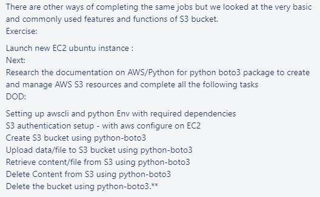

# S3 Task



<br>

### EC2 instance
- Create the EC2 instance on AWS
    - I used Ubuntu 18.04 as the AMI

<br>

### Installing AWSCLI
- When inside the EC2 instance, we will install the necessary dependencies:
    1. `sudo apt-get update`
    2. `sudo apt-get install python3-pip`
    3. `sudo apt-get install python3-venv`

- Create a virtual environment using `python3 -m venv <name>`

- Activate the virtual environment using `source <name>/bin/activate`
    - Within the `venv`, we will need to install `boto3`
    - Do this by running `pip3 install boto3`

- We now need to install `AWS CLI`. Follow the instructions found [here](https://docs.aws.amazon.com/cli/latest/userguide/install-cliv2-linux.html) :
    1. `curl "https://awscli.amazonaws.com/awscli-exe-linux-x86_64.zip" -o "awscliv2.zip"`
    2. `sudo apt-get install unzip`
        - You will need this as unzip is not pre-installed with 18.04
    3. `unzip awscliv2.zip`
    4. `sudo ./aws/install`
    5. One can check the installation is complete via `aws --version`

- Now to configure the AWS settings, run `aws configure`
    - Input the access and secret keys when prompted
    - Select the default region (`eu-west-1` for Ireland)
    - Select a default output format (can use `json`)

<br>

### Using AWSCLI
- Check the docs to know how to write commands [here](https://docs.aws.amazon.com/cli/latest/index.html)


<br>

### Checking all available buckets in S3
- A simple script to check all available buckets is found in `check.py`
    - This can also be done through AWSCLI with `aws s3 ls`

```python
import boto3

if __name__ == "__main__":
    s3 = boto3.resource("s3")

    for bucket in s3.buckets.all():
        print(bucket.name)
```

<br>

### Creating an S3 bucket

<br>

---
### Used:
- [AWS CLI](https://cloudacademy.com/blog/how-to-use-aws-cli/)